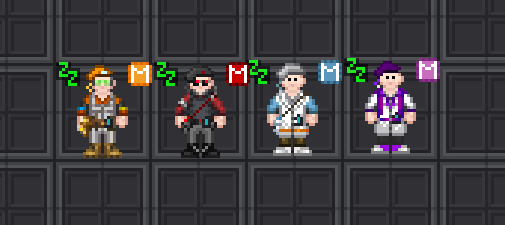
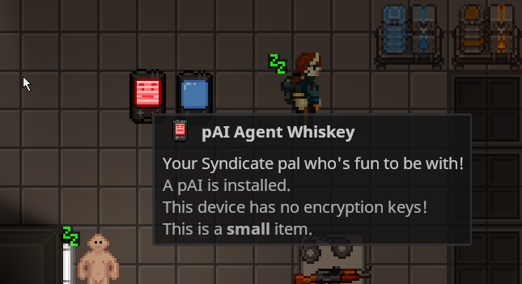

# Features

We know people love to ask what sets a server apart, so we made a page dedicated to just that!

## Ramp-up time requirements

Since this server is fresh off the press, we implemented a modifier that lets us easily scale global time requirements for roles.
At the time of writing the modifier is `0.20x`, meaning a 60 hour role currently only takes 12 hours to unlock.

## Senior roles

While not uncommon among other servers, Echo Station has dedicated senior roles.
These take a substantial amount of playtime to unlock, around 60 hours per respective department, and currently also
require server whitelisting.

## More pAI features

Personal AIs (*pAIs*) have had some neat upgrades:

### Name changing

pAI can change their own name, but the "pAI" prefix is always added to ensure they can't impersonate people on radio.

<video controls>
<source src="../static/features/pai-name-change.mp4" type="video/mp4">
</video>

### Encryption keys

You can insert any encryption key into your pAI buddy! This can be a great boon, both for crew and traitors alike.

<video controls>
<source src="../static/features/pai-encryption-keys.mp4" type="video/mp4">
</video>

## Salvage pinpointers

Finding your way back to the station has never been easier. Points to the salvage magnet.

<video controls>
<source src="../static/features/salv-pinpointer-demo.mp4" type="video/mp4">
</video>
<video controls>
<source src="../static/features/salv-pinpointer-locker.mp4" type="video/mp4">
</video>

## Blueshield role preset

A Blueshield role is commonly used to promote a security officer to a dedicated bodyguard for Command members, hence the name.
This preset lets ranking crew quickly promote officers, even giving them a dedicated icon.

<video controls>
<source src="../static/features/role-preset-blueshield.mp4" type="video/mp4">
</video>

## Executive Officer (XO) role preset

The Executive Officer is a dedicated second-in-command that the acting Commanding Officer (CO) can promote someone to.
It's a great way to offload the Captain if necessary, and also serves as an instant backup if the Captain meets an untimely end.

<video controls>
<source src="../static/features/role-preset-xo.mp4" type="video/mp4">
</video>

There is also a small amount of dedicated clothing items that can be printed from a Uniform Printer for the purposes of signifying
someone is an XO.

<video controls>
<source src="../static/features/role-preset-xo-drip.mp4" type="video/mp4">
</video>
